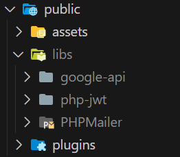

# Hướng dẫn cài đặt và chạy CoffeeShop

## Mục lục

- [Cài đặt source code](#bước-1-cài-đặt-source-code)
- [Cấu hình đường dẫn](#bước-2-cấu-hình-đường-dẫn)
- [Cấu hình URL](#bước-3-cấu-hình-url)
- [Cấu hình database](#bước-4-cấu-hình-database)
- [Cài đặt thư viện](#bước-5-cài-đặt-thư-viện)
- [Chạy dự án](#bước-6-chạy-dự-án)

## Bước 1 cài đặt source code:

Có thể thực hiện bằng 1 trong 2 cách sau:

1. Cài đặt phiên bản mới nhất:

   
   Khuyến khích nên dùng cách này vì tiết kiệm dung lượng hơn.

2. Clone `https://github.com/linhpq0610/CoffeeShop.git`.

## Bước 2: Cấu hình đường dẫn

1. Truy cập file `configs/constants/directories.php`.
2. Tìm dòng sau đây:

   ```php
   define("ROOT_DIR", "D:\WorkSpace\Ampps\www\CoffeeShop/");
   ```

   Thay đổi thành đường dẫn trên máy của bạn:

   ```php
   define("ROOT_DIR", "ĐƯỜNG_DẪN_CỦA_BẠN");
   ```

## Bước 3: Cấu hình URL

1. Truy cập file `configs/constants/urls.php`.
2. Tìm dòng sau đây:

   ```php
    define("ROOT_URL", "http://localhost/CoffeeShop/");
   ```

   Thay đổi thành URL của bạn:

   ```php
   define("ROOT_URL", "URL_CỦA_BẠN");
   ```

## Bước 4: Cấu hình database

1. Truy cập file `configs/database.php`;
2. Thay đổi:
   ```php
    $config['database'] = [
      'host' => 'localhost',
      'userName' => 'root',
      'password' => 'mysql',
      'DBName' => 'CoffeeShop',
    ];
   ```
   Thành cấu hình database của bạn:
   ```php
    $config['database'] = [
      'host' => 'HOST_CỦA_BẠN',
      'userName' => 'TÊN_NGƯỜI_DÙNG_CỦA_BẠN',
      'password' => 'MẬT_KHẨU_CỦA_BẠN',
      'DBName' => 'TÊN_DATABASE_CỦA_BẠN',
    ];
   ```
3. Import file `CoffeeShop.sql` vào database của bạn.

## Bước 5: Cài đặt thư viện

1. Tạo thư mục `libs` trong `public`
2. Giải nén `php-jwt.zip` vào thư mục `libs`
3. Giải nén `PHPMailer.zip` vào thư mục `libs`
4. Tải thư viện Google API [tại đây](https://github.com/googleapis/google-api-php-client/releases/download/v2.15.1/google-api-php-client--PHP7.4.zip)
5. Đổi tên thư mục sau giải nén thành `google-api` và đặt vào thư mục `libs`.
6. Cuối cùng thư mục sẽ có cấu trúc như sau:

   

## Bước 6: Chạy dự án

Bây giờ bạn đã cấu hình xong. Bạn có thể chạy dự án CoffeeShop trên máy tính của bạn.
